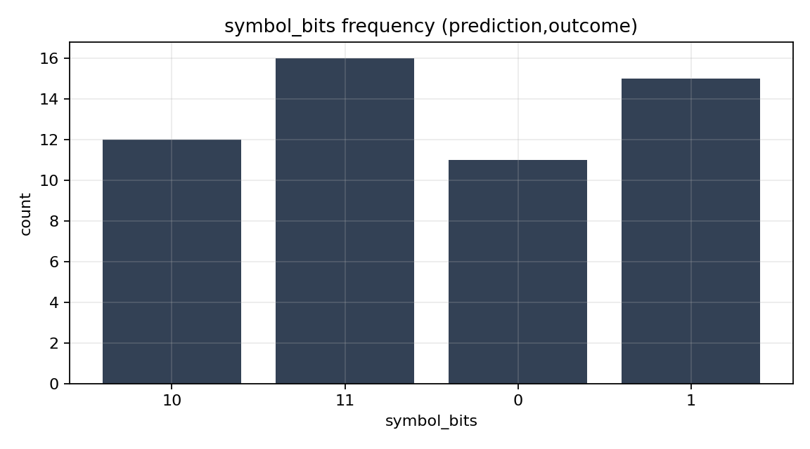
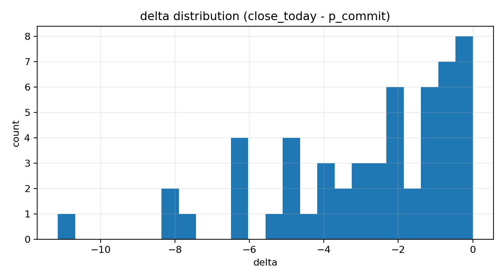
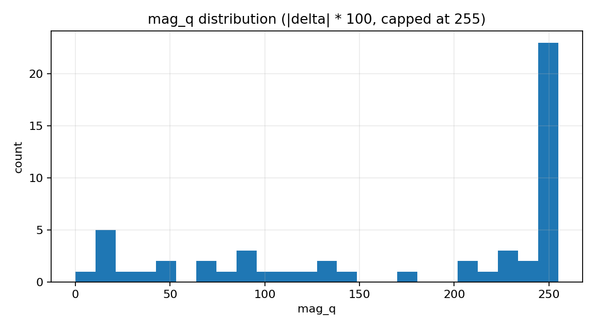
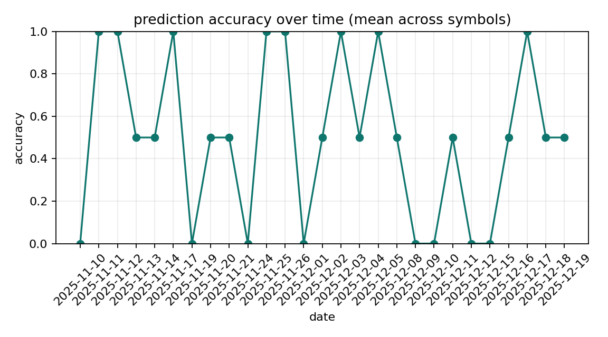
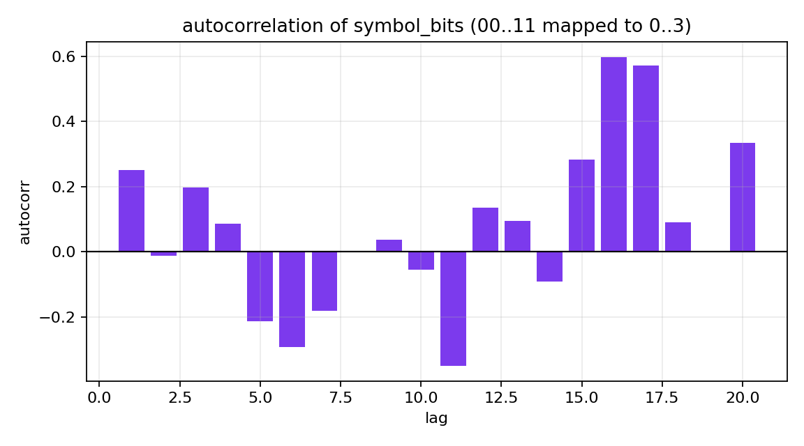

# docs

this folder meant to hold **data-driven graphs** derived from canonical log at `outputs/entropy_log.csv`

repo does not commit generated plots by default & instead you regenerate them locally from current dataset

```bash
pip install -r requirements.txt
python scripts/generate_docs.py
```

which will do a few things:
- `docs/assets/*.png`: plots
- `docs/entropy_summary.json`: small machine-readable summary (counts + entropy estimates)

## generated plots

### `symbol_bits` frequency

`symbol_bits` is the 2-bit string `"{prediction}{outcome}"`:

- `prediction ∈ {0,1}` is your model’s direction call
- `outcome ∈ {0,1}` is whether `close_today > close_prev`

The plot shows the empirical distribution over `00,01,10,11`.



### delta distribution

`delta = close_today - p_commit` where `p_commit` is the 1-minute bar close nearest 15:55 ET.



### mag_q distribution

`mag_q = min(int(abs(delta) * 100), 255)` (cents, capped).



### prediction accuracy over time

Daily mean of `(prediction == outcome)` across all rows for that date (typically one row per symbol).



### rolling Shannon entropy (symbol_bits)

Shannon entropy of the last N `symbol_bits` observations in CSV order (default window N=32).


### autocorrelation (symbol_bits)

Autocorrelation of `symbol_bits` encoded as integers `00→0, 01→1, 10→2, 11→3` for lags 1..K (default K=20).



## notes / caveats

- **Small sample sizes**: entropy estimates on short logs are unstable; treat them as exploratory diagnostics.
- **CSV order matters**: rolling entropy and autocorrelation use the row order (which is naturally append-only).
- **“Tie” days**: `tie=true` corresponds to `close_today == close_prev`; the current implementation sets `outcome=0` on ties.


